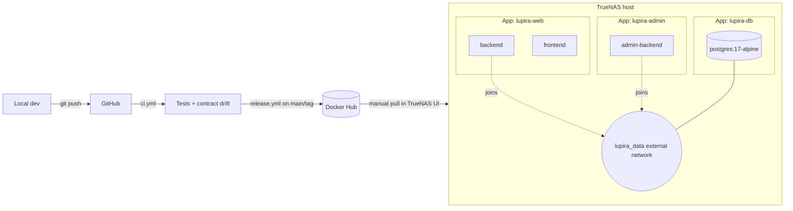

# CI/CD & Deployment Guide

End-to-end walkthrough of how LupiraWeb ships from `git push` on your laptop to a running stack on TrueNAS. If you only read one thing, read the [topology diagram](#topology) and [routine deploys](#routine-deploys).

## Topology



Three independent TrueNAS Apps share a single Docker network called `lupira_data`. The DB App owns the network; the web and admin Apps join it as `external`. Admin is a single-container service (MVC, no separate frontend image) that writes to the same Postgres.

## Pipelines

Two workflows in [.github/workflows/](../.github/workflows/).

### [ci.yml](../.github/workflows/ci.yml) — runs on every PR and non-main push

| Job | What it proves |
|---|---|
| `backend-test` | `dotnet build LupiraWeb.slnx` regenerates both public and admin OpenAPI specs; `dotnet test` runs all suites against a real Postgres via Testcontainers. |
| `contract-drift` | Both the committed [public spec](../lupiraweb.client/backend-openapi.json) and [admin spec](../lupiraweb.admin/backend-openapi.json) match what the build produces. Fails if a backend change regenerated a spec but the dev forgot to commit it. |
| `client-drift` | `npm run generate:api` produces the same Orval output as what's committed under [lupiraweb.client/src/api/](../lupiraweb.client/src/api/) (excluding the hand-written [fetcher.ts](../lupiraweb.client/src/api/fetcher.ts)). |
| `frontend-test` | `npm run lint` + `npm test` (Vitest). |

Playwright E2E is **not in CI** — run it locally with `npm run test:e2e` when it matters.

Make all four jobs required in branch protection for `main`.

### [release.yml](../.github/workflows/release.yml) — runs on push to `main` or a `v*` tag

1. Re-runs `ci.yml` via `workflow_call` — so nothing ships that didn't pass the same checks a PR did.
2. Builds three images in parallel (matrix) and pushes to Docker Hub:
   - `danbro96/lupiraweb-backend`
   - `danbro96/lupiraweb-frontend`
   - `danbro96/lupiraweb-admin-backend`

No deploy job. You decide when the NAS picks up the new image (see [Routine deploys](#routine-deploys)).

## Image tags

Emitted by `docker/metadata-action@v5`:

| Tag | When | Purpose |
|---|---|---|
| `sha-<7char>` | every push to main/tag | Immutable — **use for rollback**. |
| `latest` | push to `main` | Default tag the TrueNAS App tracks. |
| `<branch>` | push to any branch | Ad-hoc pulls from another machine. |
| `1.2.3`, `1.2`, `1` | git tag `v1.2.3` | Optional pinned releases. |

**Never deploy from `latest` expecting reproducibility.** `latest` is for humans; `sha-*` is for machines. If you need to know exactly what's running, read the `sha-*` tag off the container.

## First-time setup

### 1. GitHub secrets

Under **Settings → Secrets and variables → Actions**:

- `DOCKERHUB_USERNAME` — your Docker Hub login.
- `DOCKERHUB_TOKEN` — a Docker Hub access token with **Read & Write** scope (Account Settings → Security → New Access Token).

That's all. No production database credentials anywhere in GitHub.

### 2. TrueNAS: the `lupira-db` App

1. **Apps → Discover Apps → Custom App.**
2. Application name: `lupira-db`.
3. Paste the contents of [deploy/db/compose.yaml](../deploy/db/compose.yaml) into the YAML editor.
4. Set the required env vars (see [deploy/db/.env.example](../deploy/db/.env.example)):
   - `POSTGRES_DB=lupiraweb`
   - `POSTGRES_USER=lupira`
   - `POSTGRES_PASSWORD=<strong password>` ← write this down; the web App needs the same value.
5. Pick a TrueNAS dataset for the `pgdata` volume.
6. Save and start.

Verify the shared network exists:

```bash
# In the TrueNAS Shell
docker network inspect lupira_data
```

### 3. TrueNAS: the `lupira-web` App

1. **Discover Apps → Custom App.**
2. Application name: `lupira-web`.
3. Paste [deploy/web/compose.yaml](../deploy/web/compose.yaml).
4. Set env vars (see [deploy/web/.env.example](../deploy/web/.env.example)):
   - `POSTGRES_DB`, `POSTGRES_USER`, `POSTGRES_PASSWORD` — **must match the `lupira-db` App**.
   - `POSTGRES_HOST=postgres` (service name on the shared network).
   - `IMAGE_TAG=latest` (or pin a `sha-*` for reproducibility).
   - `FRONTEND_PORT=40080`, `BACKEND_PORT=40081` — host ports the reverse proxy targets.
5. Save and start.

Smoke-test from the TrueNAS Shell:

```bash
docker exec lupira-backend curl -sf http://localhost:80/health
# → Healthy

docker exec lupira-backend curl -sf http://localhost:80/health/ready
# → Healthy  (if this fails, DB connectivity is the likely cause)
```

### 4. TrueNAS: the `lupira-admin` App

1. **Discover Apps → Custom App.**
2. Application name: `lupira-admin`.
3. Paste [deploy/admin/compose.yaml](../deploy/admin/compose.yaml).
4. Set env vars (see [deploy/admin/.env.example](../deploy/admin/.env.example)):
   - `POSTGRES_DB`, `POSTGRES_USER`, `POSTGRES_PASSWORD` — **must match the `lupira-db` App**.
   - `POSTGRES_HOST=postgres`.
   - `IMAGE_TAG=latest` (or pin a `sha-*`).
   - `ADMIN_BACKEND_PORT=40082`.
5. Save and start.

Admin owns schema migrations. When events/projections change, apply schema once before rolling public:

```bash
docker exec -it lupira-admin-backend dotnet LupiraWeb.Admin.Server.dll --apply-schema
```

Keep the admin App behind LAN/VPN or an authenticated reverse proxy — it's a write-capable service.

### 5. Docker Hub login on the NAS (optional but recommended)

Avoids hitting the anonymous pull rate limit during rollouts:

```bash
docker login -u <dockerhub-user>
# paste a read-only token
```

### 6. Your reverse proxy

Point it at `<truenas-host>:40080` for the frontend, `<truenas-host>:40081` for the public backend, and `<truenas-host>:40082` for the admin backend. (The frontend already rewrites `/api/*` → the backend internally via Next.js, so in most topologies you only need to expose the frontend externally — the public backend port stays on your LAN. Admin should be LAN/VPN-only or behind an auth layer.)

## Routine deploys

1. Merge to `main`. [release.yml](../.github/workflows/release.yml) runs.
2. When green, `:latest` and `:sha-<short>` tags are live on Docker Hub for all three images.
3. For each TrueNAS App you want to roll (`lupira-web`, `lupira-admin`): open it → **Update** (or **Pull image** → **Restart**). If you use `IMAGE_TAG=latest`, that's it.
4. Watch logs briefly to confirm Marten connected and the health endpoint goes green.

Schema-changing deploys: apply schema via the admin `--apply-schema` CLI *before* updating the public `lupira-web` App (see [Prod-safe Marten](#prod-safe-marten)).

Nothing in this flow requires SSH, no secret sync, no Watchtower.

## Rollback

Fast path: change `IMAGE_TAG` on the web App from `latest` to a previous `sha-abc1234`, **Save**, **Pull image**, **Restart**. The old image is back in under a minute.

Find the previous `sha-*` in the commit history (`git log --oneline`) or in the Docker Hub tag list.

## Prod-safe Marten

Both backends run with Marten's `AutoCreateSchemaObjects` set to:

- `CreateOrUpdate` in **Development** — the old convenient behavior.
- `None` in **Production** — neither app mutates schema on boot.

**Admin owns schema.** Only the admin server exposes the `--apply-schema` CLI. Deploy ordering for a breaking schema change:

1. Release new images (merge to main).
2. On the NAS, apply schema via admin:
   ```bash
   docker exec -it lupira-admin-backend dotnet LupiraWeb.Admin.Server.dll --apply-schema
   ```
3. Roll the `lupira-admin` App (so admin's new code writes against the updated schema).
4. Roll the `lupira-web` App (so public reads the updated schema).

The shared kernel lives in [LupiraWeb.Domain](../LupiraWeb.Domain/): event records, aggregate documents, projection docs, and `UseLupiraProjections()` — the single place that registers all 17 projections. Both backends reference it; admin calls `UseLupiraProjections()` to wire the write-side logic, public calls the same helper because inline projections are idempotent and public never writes events in prod.

## Troubleshooting

**`contract-drift` fails in CI.** You edited a backend but didn't commit the regenerated spec. Run `dotnet build LupiraWeb.slnx` locally, then `git add lupiraweb.client/backend-openapi.json lupiraweb.admin/backend-openapi.json`, commit, push.

**`client-drift` fails in CI.** You bumped the OpenAPI spec but didn't regenerate the client. `cd lupiraweb.client && npm run generate:api`, commit the result.

**`backend-test` fails with `No such host is known` or Testcontainers hangs.** The GitHub-hosted runner lost its Docker daemon — rerun the job. If persistent, pin `ubuntu-latest` to a known-good runner version.

**Image pull fails on TrueNAS with `429 Too Many Requests`.** Docker Hub anonymous rate limit. `docker login` on the NAS with a read-only token.

**Backend boots but `/health/ready` stays red.** The backend can't reach Postgres. Check:
- `POSTGRES_HOST` in the web App env matches the service name in `deploy/db/compose.yaml` (default: `postgres`).
- Both containers are on the `lupira_data` network: `docker network inspect lupira_data`.
- Credentials match between the two Apps.

**Marten refuses to start in prod with a schema error.** You changed events/projections but didn't apply the schema change. Run the one-shot schema apply (see [Prod-safe Marten](#prod-safe-marten)).

**Need to pin a specific image forever.** Set `IMAGE_TAG=sha-abc1234` in the web App env. That tag is immutable.
