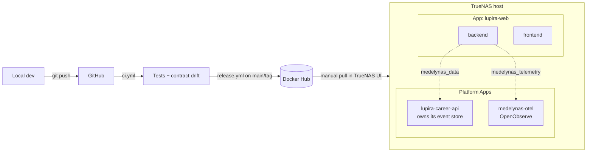

# CI/CD & Deployment Guide

End-to-end walkthrough of how LupiraWeb ships from `git push` on your laptop to a running stack on TrueNAS. If you only read one thing, read the [topology diagram](#topology) and [routine deploys](#routine-deploys).

## Topology


```mermaid
flowchart LR
  dev[Local dev] -->|git push| gh[GitHub]
  gh -->|ci.yml| tests[Tests + contract drift]
  tests -->|release.yml on main/tag| dh[(Docker Hub)]
  dh -->|manual pull in TrueNAS UI| nas[TrueNAS 25.10.1]

  subgraph nas[TrueNAS host]
    subgraph platform[Platform Apps]
      career[lupira-career-api<br/>owns its event store]
      otel[medelynas-otel<br/>OpenObserve]
    end
    subgraph web_app[App: lupira-web]
      be[backend]
      fe[frontend]
    end
    be -.medelynas_data.-> career
    be -.medelynas_telemetry.-> otel
  end
```

LupiraWeb runs as a **single** `lupira-web` App (backend + frontend). The backend is a stateless BFF: it holds no database, reads career/résumé data from **LupiraCareerApi** over HTTP, and emits OTLP to the platform's **`medelynas-otel`** OpenObserve (which owns external network `medelynas_telemetry`). CareerApi is reachable by service name over `medelynas_data`, or publicly at `career-api.lupira.com`; the App joins `medelynas_data` for the internal reach and `medelynas_telemetry` for OTLP egress. CareerApi owns its own event store and schema — LupiraWeb stands up no DB of its own. The writer/admin is a separate private repo, [LupiraFamilyWeb](https://github.com/danbro96/LupiraFamilyWeb).

## Pipelines

Two workflows in [.github/workflows/](../.github/workflows/).

### [ci.yml](../.github/workflows/ci.yml) — runs on every PR and non-main push

| Job | What it proves |
|---|---|
| `backend-test` | `dotnet build LupiraWeb.slnx` regenerates the public OpenAPI spec; `dotnet test` runs the xUnit suites (handler unit tests + `WebApplicationFactory` integration tests against an in-process CareerApi stub — no Postgres, no Testcontainers). |
| `contract-drift` | The committed [public spec](../lupiraweb.client/backend-openapi.json) matches what the build produces. Fails if a backend change regenerated the spec but the dev forgot to commit it. |
| `client-drift` | `npm run generate:api` produces the same Orval output as what's committed under [lupiraweb.client/src/api/](../lupiraweb.client/src/api/) (excluding the hand-written [fetcher.ts](../lupiraweb.client/src/api/fetcher.ts)). |
| `frontend-test` | `npm run lint` + `npm test` (Vitest). |

Playwright E2E is **not in CI** — run it locally with `npm run test:e2e` when it matters.

Make all four jobs required in branch protection for `main`.

### [release.yml](../.github/workflows/release.yml) — runs on push to `main` or a `v*` tag

1. Re-runs `ci.yml` via `workflow_call` — so nothing ships that didn't pass the same checks a PR did.
2. Builds two images in parallel (matrix) and pushes to Docker Hub:
   - `danbro96/lupiraweb-backend`
   - `danbro96/lupiraweb-frontend`

No deploy job. You decide when the NAS picks up the new image (see [Routine deploys](#routine-deploys)).

## Image tags

Emitted by `docker/metadata-action@v5`:

| Tag | When | Purpose |
|---|---|---|
| `sha-<7char>` | every push to main/tag | Immutable — **use for rollback**. |
| `latest` | push to `main` | Default tag the TrueNAS App tracks. |
| `<branch>` | push to any branch | Ad-hoc pulls from another machine. |
| `1.2.3`, `1.2`, `1` | git tag `v1.2.3` | Optional pinned releases. |

**Never deploy from `latest` expecting reproducibility.** `latest` is for humans; `sha-*` is for machines. If you need to know exactly what's running, read the `sha-*` tag off the container.

## First-time setup

### 1. GitHub secrets

Under **Settings → Secrets and variables → Actions**:

- `DOCKERHUB_USERNAME` — your Docker Hub login.
- `DOCKERHUB_TOKEN` — a Docker Hub access token with **Read & Write** scope (Account Settings → Security → New Access Token).

That's all. No production credentials anywhere in GitHub.

### 2. TrueNAS: the `lupira-web` App

Prerequisites: `lupira-career-api` and the `medelynas-otel` Custom App already exist on the host. If OTel doesn't, see [Guides/otel-collector.md](../../DevOps/Guides/otel-collector.md). LupiraWeb stands up no database of its own.

1. **Discover Apps → Custom App.**
2. Application name: `lupira-web`.
3. Paste [deploy/compose.yaml](../deploy/compose.yaml). The compose joins external networks `medelynas_data` (to reach CareerApi by service name) and `medelynas_telemetry` (for OTLP); both must already exist.
4. Set env vars (see [deploy/.env.example](../deploy/.env.example)):
   - `IMAGE_TAG=latest` (or pin a `sha-*` for reproducibility).
   - `FRONTEND_PORT=40080`, `BACKEND_PORT=40081` — host ports the reverse proxy targets.
   - `CAREERAPI_BASE_URL=http://lupira-career-api:8080` (service name over `medelynas_data`), or `https://career-api.lupira.com` if not co-located.
   - `CAREERAPI_AUTH_TOKEN=<owner bearer>` — Authentik OIDC JWT for audience `lupira-career`. Blank until a token is issued.
   - `DEMOS_*_BASE_URL` / `DEMOS_*_API_KEY` for the Chat / TextToSpeech / Vision demo upstreams (required base URLs).
   - `OTEL_EXPORTER_OTLP_ENDPOINT=http://otel-collector:5080/api/default` (OpenObserve hostname alias on `medelynas_telemetry`).
   - `OTEL_EXPORTER_OTLP_PROTOCOL=http/protobuf`.
   - `OTEL_EXPORTER_OTLP_HEADERS=Authorization=Basic <base64>` (OpenObserve OSS auth — generate per [Guides/otel-collector.md](../../DevOps/Guides/otel-collector.md)).
   - `OTEL_RESOURCE_ATTRIBUTES=deployment.environment=prod,host.name=medelynas`.
5. Save and start.

Smoke-test from the TrueNAS Shell:

```bash
docker exec lupira-backend curl -sf http://localhost:80/livez
# → Healthy

docker exec lupira-backend curl -sf http://localhost:80/readyz
# → Healthy  (readiness pings CareerApi; if this fails, CareerApi reachability is the likely cause)
```

### 3. Docker Hub login on the NAS (optional but recommended)

Avoids hitting the anonymous pull rate limit during rollouts:

```bash
docker login -u <dockerhub-user>
# paste a read-only token
```

### 4. Your reverse proxy

Point it at `<truenas-host>:40080` for the frontend and `<truenas-host>:40081` for the public backend. (The frontend already rewrites `/api/*` → the backend internally via Next.js, so in most topologies you only need to expose the frontend externally — the backend port stays on your LAN.)

## Routine deploys

1. Merge to `main`. [release.yml](../.github/workflows/release.yml) runs.
2. When green, `:latest` and `:sha-<short>` tags are live on Docker Hub for both images.
3. Open the `lupira-web` App → **Update** (or **Pull image** → **Restart**). If you use `IMAGE_TAG=latest`, that's it.
4. Watch logs briefly to confirm `/readyz` goes green (it pings CareerApi).

Nothing in this flow requires SSH, no secret sync, no Watchtower.

## Rollback

Fast path: change `IMAGE_TAG` on the web App from `latest` to a previous `sha-abc1234`, **Save**, **Pull image**, **Restart**. The old image is back in under a minute.

Find the previous `sha-*` in the commit history (`git log --oneline`) or in the Docker Hub tag list.

## Troubleshooting

**`contract-drift` fails in CI.** You edited a backend but didn't commit the regenerated spec. Run `dotnet build LupiraWeb.Server` locally, then `git add lupiraweb.client/backend-openapi.json`, commit, push.

**`client-drift` fails in CI.** You bumped the OpenAPI spec but didn't regenerate the client. `cd lupiraweb.client && npm run generate:api`, commit the result.

**`backend-test` fails with `No such host is known` or hangs.** The GitHub-hosted runner lost its Docker daemon — rerun the job. If persistent, pin `ubuntu-latest` to a known-good runner version.

**Image pull fails on TrueNAS with `429 Too Many Requests`.** Docker Hub anonymous rate limit. `docker login` on the NAS with a read-only token.

**Backend boots but `/readyz` stays red.** The backend can't reach CareerApi. Check:
- `CAREERAPI_BASE_URL` resolves (service name `lupira-career-api` on `medelynas_data`, or the public `career-api.lupira.com`).
- The backend container is on the `medelynas_data` network: `docker network inspect medelynas_data`.
- `CAREERAPI_AUTH_TOKEN` is a valid owner bearer for audience `lupira-career` (a 401 from CareerApi also fails readiness).

**No traces or metrics in OpenObserve for `lupira-web`.** Telemetry is silently failing or the wrong target. Check:
- `OTEL_EXPORTER_OTLP_ENDPOINT=http://otel-collector:5080/api/default` — note `http`, not `https`, OpenObserve's HTTP port `5080`, and the `/api/default` org segment.
- `OTEL_EXPORTER_OTLP_HEADERS=Authorization=Basic <base64>` is set — without it OpenObserve rejects ingestion silently.
- The backend container is on `medelynas_telemetry`: `docker network inspect medelynas_telemetry`.
- OpenObserve logs: `sudo docker logs openobserve --tail 50 | grep -iE 'unauth|401|reject'`.

**Need to pin a specific image forever.** Set `IMAGE_TAG=sha-abc1234` in the web App env. That tag is immutable.
